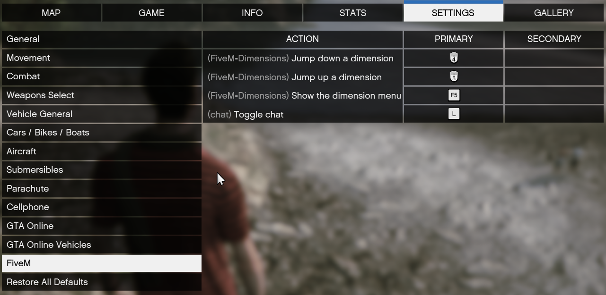

# Installation And Usage Instructions

## Installing the resource

### Build it yourself

Navigate to your servers resource folder eg `C:\FXServer\server-data\resources`

Your layout may differ but it'll be the folder where all your other mod resources are installed

Clone the repo using

```bash
git clone https://github.com/Muu79/FiveM-Dimensions.git
```

Navigate into the cloned repo and move into the web directory and install dependecies with [npm](https://nodejs.org/en/download) or [yarn](https://classic.yarnpkg.com/lang/en/docs/install/#windows-stable)

```bash
cd ./web
npm install
# or
yarn install
```

Then build the web files

```bash
npm run build
# or
yarn build
```

### or use prebuilt release

Download the zip file from the lastest [release](https://github.com/Muu79/FiveM-Dimensions/releases/latest/download/FiveM-Dimensions.zip) then extract the file into your resources folder

## Start the resource

add `ensure FiveM-Dimensions` to your `server.cfg` file or run `ensure FiveM-Dimensions` inside your server terminal once it has started

## Usage

Press F5 to open the menu


Use enter to select any of the options navigating using the arrow keys. Use F5 again to close the menu

- Option 1 (Toggle Seeker) toggles the player between the player and seeker role changing your cooldown
- Option 2 (Set Dimension limit) sets the amount of dimensions to be used
- Option 3 and 4 (Set Hider/Seeker Cooldown) sets the respective role's cooldown in seconds
- Option 5 (Toggle Dimension HUD) turns on the dimension count and role info HUD.

The HUD looks like this


## Controls

MOUSE_BUTTON 4 and 5 (first two side mice buttons) move the player up and down dimensions. These can be rebound in the GTA keybindings menu under the FiveM tab. You can also rebind the key to open the menu but you *Must* use F5 to close it


